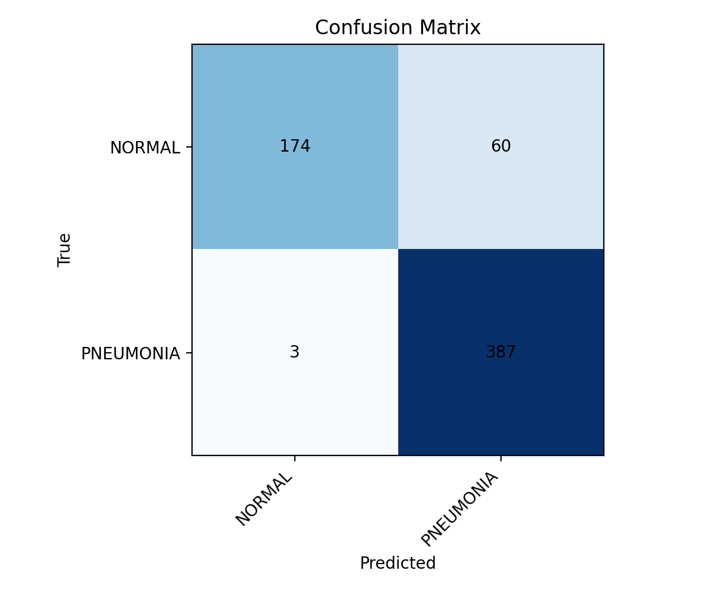
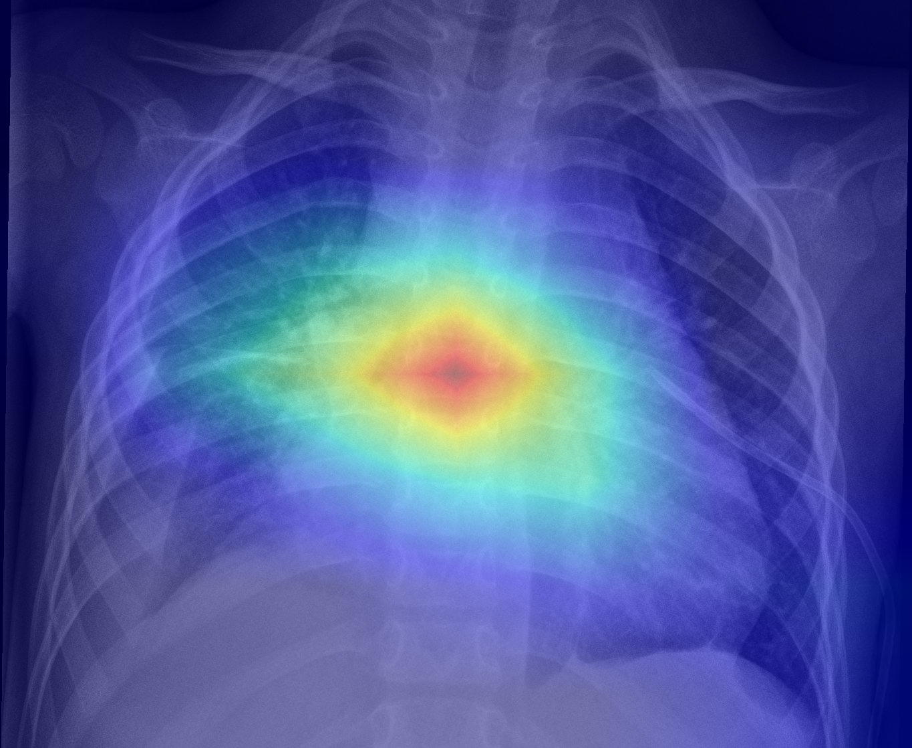

# Pneumonia X-ray Classification with PyTorch

This project demonstrates how deep learning can be applied to **medical image analysis**, specifically the classification of **chest X-ray scans** into *Normal* vs. *Pneumonia*.  
The work is built around transfer learning in PyTorch and shows how modern computer vision methods can be adapted to a clinically relevant problem.

---

## Motivation
Pneumonia is one of the most common lung infections, and chest X-rays remain the primary diagnostic tool.  
While radiologists are highly accurate, automated support systems can provide:
- faster second opinions,
- assistance in large-scale screening,
- reproducible training examples for medical education.

This project is purely educational and **not intended for clinical use**.  
The main goal was to practice:
- using **PyTorch** for computer vision,
- applying **transfer learning** on medical data,
- building explainable models with visualization tools (Grad-CAM).

---

## Dataset

- **Source:** [Chest X-Ray Images (Pneumonia) - Kaggle](https://www.kaggle.com/datasets/paultimothymooney/chest-xray-pneumonia)  
- ~5,800 labeled chest X-ray images  
- Pre-split into **train / val / test** sets  
- Two classes:  
  - **NORMAL**  
  - **PNEUMONIA**

For reproducibility, the dataset itself is not included in this repository.  
Instead, a small folder `assets/demo_images/` contains ~10 example images that can be used to quickly test the model.

---

## Results

The model was trained using **ResNet18** (pretrained on ImageNet) with fine-tuning of later layers.  
Weighted loss was applied to handle class imbalance.

**Test set performance:**
- Accuracy: **0.899**  
- Precision: **0.866**  
- Recall: **0.992**  
- F1-score: **0.925**

Confusion matrix on the held-out test set:



---
## Grad-CAM Visualizations

Below are some Grad-CAM overlays showing which regions the model used for classification:
<p align="center">
  
  
</p>

## Quick Demo

1. Clone the repository and create a virtual environment:
   ```bash
   git clone https://github.com/<your-username>/pneumonia-xray-pytorch.git
   cd pneumonia-xray-pytorch
   python -m venv .venv
   source .venv/bin/activate   # Windows: .venv\Scripts\activate
   
## Data structure
```
pneumonia-xray-pytorch/
├─ assets/
│  └─ demo_images/
│     ├─ NORMAL_01.jpg
│     ├─ NORMAL_02.jpg
│     ├─ PNEUMONIA_01.jpg
│     └─ ...
├─ checkpoints/           # ignored (best_model.pt ovde)
├─ data/                  # ignored (full dataset lokalno)
├─ outputs/
│  ├─ figures/            # loss curves, confusion matrix, grad-CAM PNGs
│  └─ metrics/            # metrics_*.xlsx, history.csv
├─ src/
│  ├─ datasets.py
│  ├─ models.py
│  ├─ train.py            # early stopping + LR scheduler
│  └─ test.py             # quick eval / single-image demo
├─ .gitignore
├─ LICENSE
├─ README.md
└─ requirements.txt
```

## Next steps / possible extensions
- Try deeper models: ResNet34, DenseNet, EfficientNet.
- Add Grad-CAM visualizations to highlight which lung regions the model uses for its decision.
- Experiment with data augmentation or self-supervised pretraining.
- Build a lightweight Streamlit web demo for interactive testing.

## Licence
MIT License. Free to use for educational and research purposes.